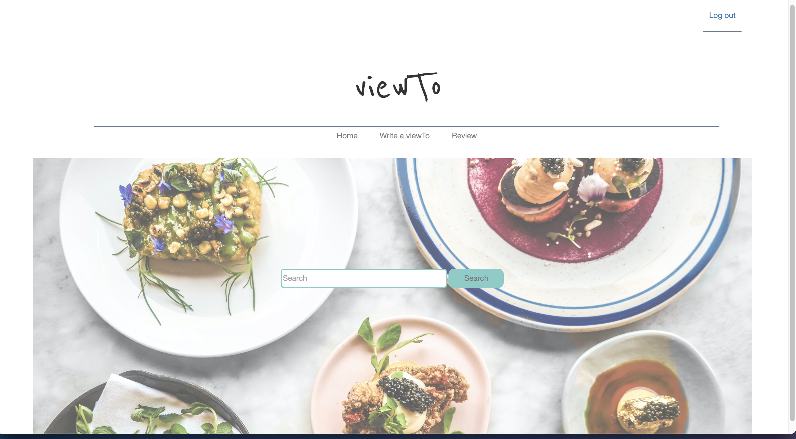
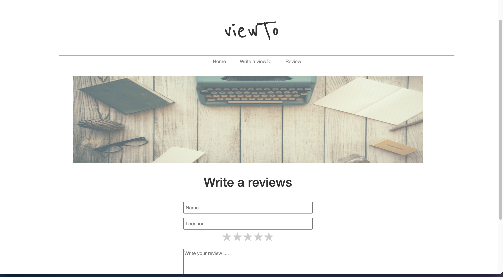
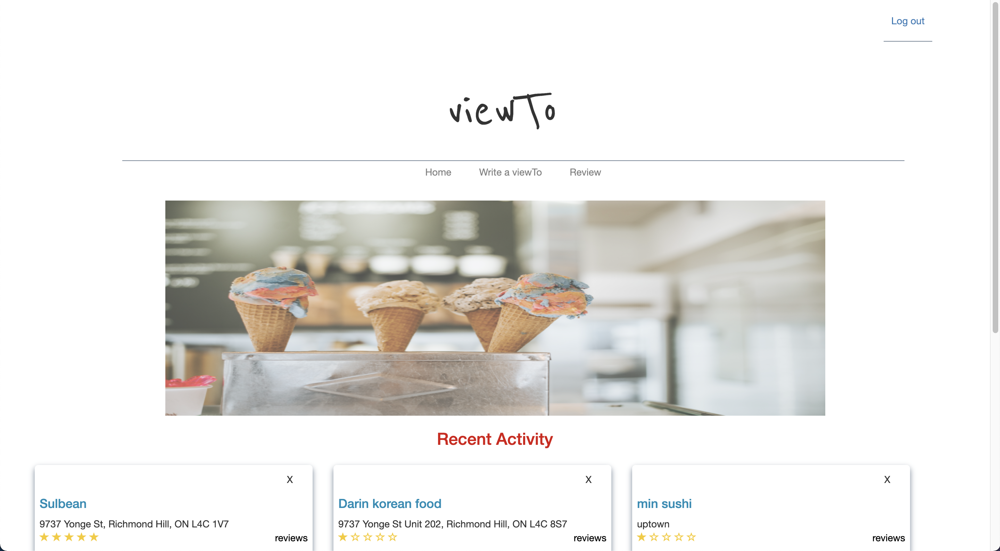

viewTo

viewTO is an app for people can write a review about all kind of food. The user can write a name, location, description and rate by the star. The user can used the home page search bar to find the name of post. The user must login in the write a reviews page to open and write a review about food. Users can check all the review post that people wrote on the reviews page. Share the post with other people to see! Write a comment about other post! 

Screenshot

Technologies Used

HTML
CSS
JavaScript
MongoDB
Mongoose
NodeJS
Node Express
Google OAuth
Bootstrap

Getting Stared

https://viewto.herokuapp.com/reviews/home

Next Steps 

https://replit.com/@JinnyChoi1/project-2-wireframe#trello.png

